# Hired! Developer Guide
--------------------------------------------------------------------------------------------------------------------

## **Acknowledgements**

* This project is adapted from [AddressBook-Level3 (AB3)](https://github.com/se-edu/addressbook-level3) by the SE-EDU initiative.
* Diagrams are created using [PlantUML](https://plantuml.com/).
* The project uses the [JavaFX](https://openjfx.io/) framework.
--------------------------------------------------------------------------------------------------------------------

## **Setting up, getting started**

Refer to the guide [_Setting up and getting started_](SettingUp.md).

--------------------------------------------------------------------------------------------------------------------

## **Design**

<div markdown="span" class="alert alert-primary">

:bulb: **Tip:** The `.puml` files used to create diagrams are in this document `docs/diagrams` folder. Refer to the [_PlantUML Tutorial_ at se-edu/guides](https://se-education.org/guides/tutorials/plantUml.html) to learn how to create and edit diagrams.
</div>

### Architecture


The ***Architecture Diagram*** given above explains the high-level design of the App.

Given below is a quick overview of main components and how they interact with each other.

**Main components of the architecture**

**`Main`** (consisting of classes [`Main`](https://github.com/se-edu/addressbook-level3/tree/master/src/main/java/seedu/address/Main.java) and [`MainApp`](https://github.com/se-edu/addressbook-level3/tree/master/src/main/java/seedu/address/MainApp.java)) is in charge of the app launch and shut down.
* At app launch, it initializes the other components in the correct sequence, and connects them up with each other.
* At shut down, it shuts down the other components and invokes cleanup methods where necessary.

The bulk of the app's work is done by the following four components:

* [**`UI`**](#ui-component): The UI of the App.
* [**`Logic`**](#logic-component): The command executor.
* [**`Model`**](#model-component): Holds the data of the App in memory.
* [**`Storage`**](#storage-component): Reads data from, and writes data to, the hard disk.

[**`Commons`**](#common-classes) represents a collection of classes used by multiple other components.

**How the architecture components interact with each other**

The *Sequence Diagram* below shows how the components interact with each other for the scenario where the user issues the command `delete 1`.

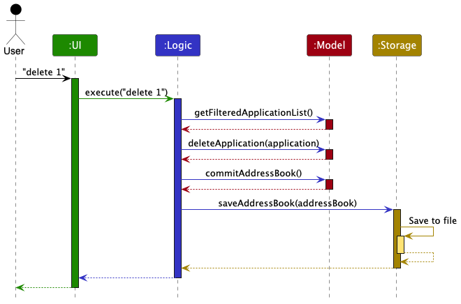

Each of the four main components (also shown in the diagram above),

* defines its *API* in an `interface` with the same name as the Component.
* implements its functionality using a concrete `{Component Name}Manager` class (which follows the corresponding API `interface` mentioned in the previous point.)

For example, the `Logic` component defines its API in the `Logic.java` interface and implements its functionality using the `LogicManager.java` class which follows the `Logic` interface. Other components interact with a given component through its interface rather than the concrete class (reason: to prevent outside component's being coupled to the implementation of a component), as illustrated in the (partial) class diagram below.


The sections below give more details of each component.

### UI component

The **API** of this component is specified in [`Ui.java`](https://github.com/AY2526S2-CS2103T-T13-3/tp/blob/master/src/main/java/seedu/address/ui/Ui.java)

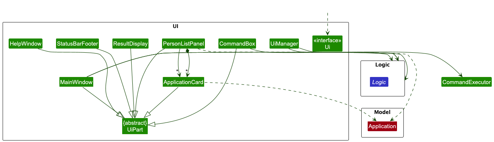

The UI consists of a `MainWindow` that is made up of parts e.g.`CommandBox`, `ResultDisplay`, `PersonListPanel`, `StatusBarFooter` etc. All these, including the `MainWindow`, inherit from the abstract `UiPart` class which captures the commonalities between classes that represent parts of the visible GUI.

The `UI` component uses the JavaFx UI framework. The layout of these UI parts are defined in matching `.fxml` files that are in the `src/main/resources/view` folder. For example, the layout of the [`MainWindow`](https://github.com/AY2526S2-CS2103T-T13-3/tp/blob/master/src/main/java/seedu/address/ui/MainWindow.java) is specified in [`MainWindow.fxml`](https://github.com/AY2526S2-CS2103T-T13-3/tp/blob/master/src/main/resources/view/MainWindow.fxml)

The `UI` component,

* executes user commands using the `Logic` component.
* listens for changes to `Model` data so that the UI can be updated with the modified data.
* keeps a reference to the `Logic` component, because the `UI` relies on the `Logic` to execute commands.
* depends on some classes in the `Model` component, as it displays `Application` object residing in the `Model`.

### Logic component

**API** : [`Logic.java`](https://github.com/AY2526S2-CS2103T-T13-3/tp/blob/master/src/main/java/seedu/address/logic/Logic.java)

Here's a (partial) class diagram of the `Logic` component:

<div markdown="span" class="alert alert-info">
:information_source: **Note:** Only representative concrete `Command` subclasses are shown here (e.g., `AddCommand`, `DeleteCommand`, `FindCommand`) to keep the diagram readable. The diagram is not an exhaustive list of all command classes.
</div>

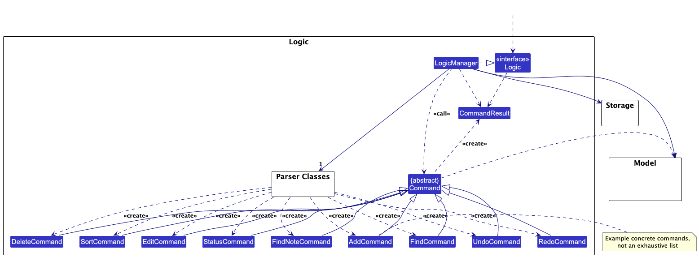

The sequence diagram below illustrates the interactions within the `Logic` component, taking `execute("delete 1")` API call as an example.


<div markdown="span" class="alert alert-info">:information_source: **Note:** The lifeline for `DeleteCommandParser` should end at the destroy marker (X) but due to a limitation of PlantUML, the lifeline continues till the end of diagram.
</div>

How the `Logic` component works:

1. When `Logic` is called upon to execute a command, it is passed to an `AddressBookParser` object which in turn creates a parser that matches the command (e.g., `DeleteCommandParser`) and uses it to parse the command.
2. This results in a `Command` object (more precisely, an object of one of its subclasses e.g., `DeleteCommand`) which is executed by the `LogicManager`.
3. The command can communicate with the `Model` when it is executed (e.g. to delete an application).<br>
   Note that although this is shown as a single step in the diagram above (for simplicity), in the code it can take several interactions (between the command object and the `Model`) to achieve.
4. The result of the command execution is encapsulated as a `CommandResult` object which is returned back from `Logic`.

Here are the other classes in `Logic` (omitted from the class diagram above) that are used for parsing a user command:


How the parsing works:
* When called upon to parse a user command, the `AddressBookParser` class creates an `XYZCommandParser` (`XYZ` is a placeholder for the specific command name e.g., `AddCommandParser`) which uses the other classes shown above to parse the user command and create a `XYZCommand` object (e.g., `AddCommand`) which the `AddressBookParser` returns back as a `Command` object.
* All `XYZCommandParser` classes (e.g., `AddCommandParser`, `DeleteCommandParser`, ...) inherit from the `Parser` interface so that they can be treated similarly where possible e.g, during testing.

### Model component
**API** : [`Model.java`](https://github.com/AY2526S2-CS2103T-T13-3/tp/blob/master/src/main/java/seedu/address/model/Model.java)

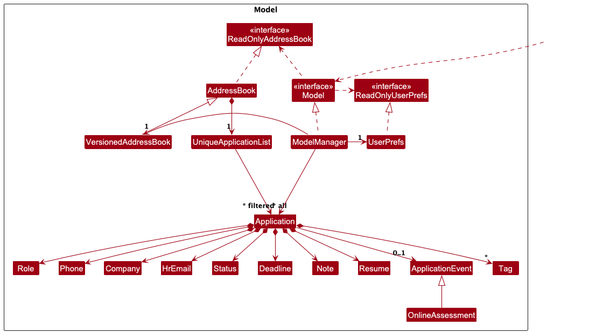


The `Model` component,

* stores the address book data i.e., all `Application` objects (which are contained in a `UniqueApplicationList` object).
* stores the currently 'selected' `Application` objects (e.g., results of a search query) as a separate _filtered_ list which is exposed to outsiders as an unmodifiable `ObservableList<Application>` that can be 'observed' e.g. the UI can be bound to this list so that the UI automatically updates when the data in the list change.
* stores a `UserPref` object that represents the user’s preferences. This is exposed to the outside as a `ReadOnlyUserPref` objects.
* does not depend on any of the other three components (as the `Model` represents data entities of the domain, they should make sense on their own without depending on other components)


### Storage component

**API** : [`Storage.java`](https://github.com/AY2526S2-CS2103T-T13-3/tp/blob/master/src/main/java/seedu/address/storage/Storage.java)

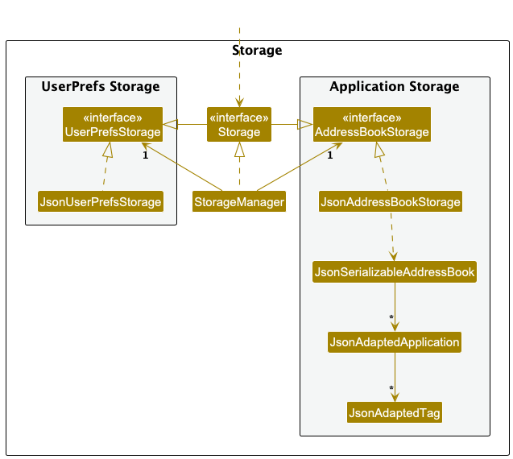

The `Storage` component,
* can save both address book data and user preference data in JSON format, and read them back into corresponding objects.
* inherits from both `AddressBookStorage` and `UserPrefStorage`, which means it can be treated as either one (if only the functionality of only one is needed).
* depends on some classes in the `Model` component (because the `Storage` component's job is to save/retrieve objects that belong to the `Model`)

### Common classes

Classes used by multiple components are in the `seedu.address.commons` package.

--------------------------------------------------------------------------------------------------------------------

## **Implementation**

This section describes some noteworthy details on how certain features are implemented.

## Undo/redo feature

#### Implementation

The undo/redo mechanism is facilitated by `VersionedAddressBook`. It extends `AddressBook` with an undo/redo history, stored internally as an `addressBookStateList` and `currentStatePointer`. Additionally, it implements the following operations:

* `VersionedAddressBook#commit()` — Saves the current application book state in its history.
* `VersionedAddressBook#undo()` — Restores the previous application book state from its history.
* `VersionedAddressBook#redo()` — Restores a previously undone application book state from its history.

These operations are exposed in the `Model` interface as `Model#commitAddressBook()`, `Model#undoAddressBook()`, and `Model#redoAddressBook()`.

In the current implementation, undo/redo also restores the reminder-highlight toggle state in `UserPrefs`. `ModelManager` maintains a parallel `reminderHighlightStateList` (with its own pointer) and updates it together with `VersionedAddressBook`, so `undo` / `redo` keeps both data state and reminder-highlight preference consistent.

Given below is an example usage scenario and how the undo/redo mechanism behaves at each step.

Step 1. The user launches the application for the first time. The `VersionedAddressBook` will be initialized with the initial application book state, and the `currentStatePointer` pointing to that single application book state.

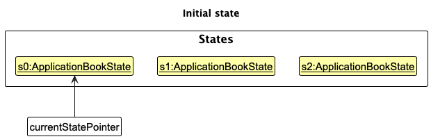

Step 2. The user executes `delete 5` command to delete the 5th application in the list. The `delete` command calls `Model#commitAddressBook()`, causing the modified state of the application book after the `delete 5` command executes to be saved in the `addressBookStateList`, and the `currentStatePointer` is shifted to the newly inserted application book state.

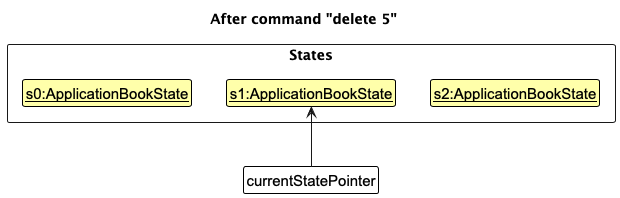

Step 3. The user executes `add r/Software Engineer p/98765432 e/hr@google.com c/Google l/Singapore t/interview note/Met recruiter at career fair` to add a new application. The `add` command also calls `Model#commitAddressBook()`, causing another modified application book state to be saved into the `addressBookStateList`.

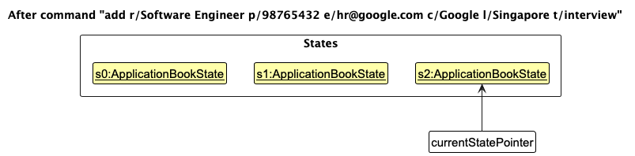

<div markdown="span" class="alert alert-info">:information_source: **Note:** If a command fails its execution, it will not call `Model#commitAddressBook()`, so the application book state will not be saved into the `addressBookStateList`.

</div>

Step 4. The user now decides that adding the application was a mistake, and decides to undo that action by executing the `undo` command. The `undo` command will call `Model#undoAddressBook()`, which will shift the `currentStatePointer` once to the left, pointing it to the previous application book state, and restores the application book to that state.

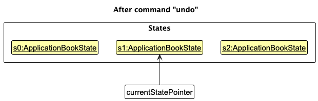

<div markdown="span" class="alert alert-info">:information_source: **Note:** If the `currentStatePointer` is at index 0, pointing to the initial application book state, then there are no previous application book states to restore. The `undo` command uses `Model#canUndoAddressBook()` to check if this is the case. If so, it will return an error to the user rather
than attempting to perform the undo.

</div>

The following sequence diagram shows how an undo operation goes through the `Logic` component:


<div markdown="span" class="alert alert-info">:information_source: **Note:** The lifeline for `UndoCommand` should end at the destroy marker (X) but due to a limitation of PlantUML, the lifeline reaches the end of diagram.

</div>

Similarly, how an undo operation goes through the `Model` component is shown below:


The `redo` command does the opposite — it calls `Model#redoAddressBook()`, which shifts the `currentStatePointer` once to the right, pointing to the previously undone state, and restores the application book to that state.

<div markdown="span" class="alert alert-info">:information_source: **Note:** If the `currentStatePointer` is at index `addressBookStateList.size() - 1`, pointing to the latest application book state, then there are no undone application book states to restore. The `redo` command uses `Model#canRedoAddressBook()` to check if this is the case. If so, it will return an error to the user rather than attempting to perform the redo.

</div>

Step 5. The user then executes `list`. Commands that only change the current view (e.g. `list`, `find`, `findnote`) do not call `Model#commitAddressBook()`, so `addressBookStateList` remains unchanged. For `reminder`, only an **effective** run (first-time highlight enable, or sorted order actually changes) calls `Model#commitAddressBook()` and creates a new checkpoint; a no-op `reminder` does not.

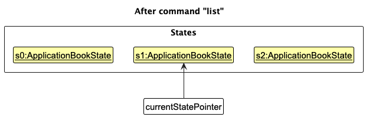

Step 6. The user executes `clear`, which calls `Model#commitAddressBook()`. Since the `currentStatePointer` is not pointing at the end of the `addressBookStateList`, all application book states after the `currentStatePointer` will be purged. Reason: It no longer makes sense to redo the previous `add` command after a new branch of changes. This is the behavior that most modern desktop applications follow.

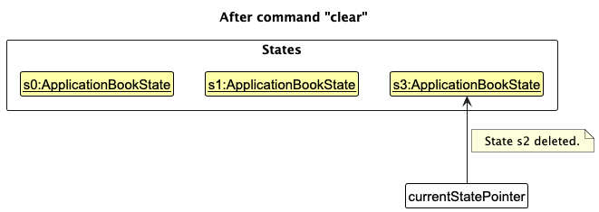

#### Design considerations:

**Aspect: How undo & redo executes:**

* **Alternative 1 (current choice):** Saves the entire application book.
    * Pros: Easy to implement.
    * Cons: May have performance issues in terms of memory usage.

* **Alternative 2:** Individual command knows how to undo/redo by
  itself.
    * Pros: Will use less memory (e.g. for `delete`, just save the application being deleted).
    * Cons: We must ensure that the implementation of each individual command are correct.


## Reminder Feature

The following sequence diagram shows how a `reminder` operation goes through the `Logic` component:

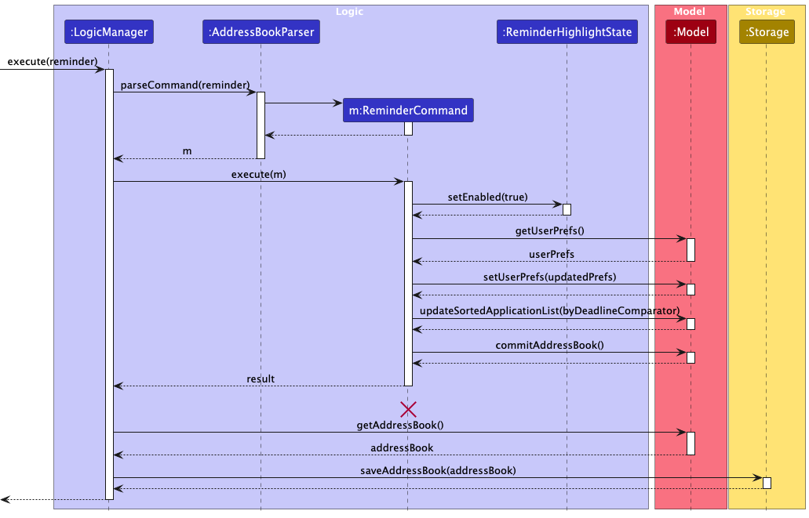

How the `reminder` command works:

1. When the user enters a `reminder` command, `LogicManager` passes it to `AddressBookParser`.
2. `AddressBookParser` creates a `ReminderCommand` object.
3. `ReminderCommand` enables UI highlighting via `ReminderHighlightState`.
4. `ReminderCommand` reads and updates `UserPrefs` to persist the reminder highlight toggle.
5. `ReminderCommand` sorts the application list by deadline.
6. `ReminderCommand` calls `Model#commitAddressBook()` **only when the run is effective** (e.g. first-time highlight enable, or sorted order actually changes). A no-op `reminder` does not create a new undo/redo checkpoint.


## Sort Feature

The sequence diagram below illustrates the interactions within the `Logic` component for a `sort` command.


How the `sort` command works:

1. When the user enters a `sort` command, `LogicManager` passes it to `AddressBookParser`.
2. `AddressBookParser` creates a `SortCommandParser` to parse command arguments.
3. `SortCommandParser` validates and parses the sort criteria.
4. A `SortCommand` object is created and executed.
5. `SortCommand` selects a comparator based on the parsed criteria.
6. `SortCommand` updates the sorted application list (`Model#updateSortedApplicationList(...)`).
7. The updated application book state is committed through `Model#commitAddressBook()`.

## Find Note Feature

#### Implementation

The sequence diagram below illustrates the interactions within the `Logic` component for a `findnote` command.

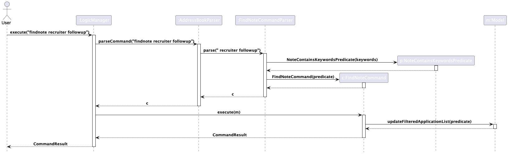

The class diagram below shows the parsing-related structure for the `findnote` command.

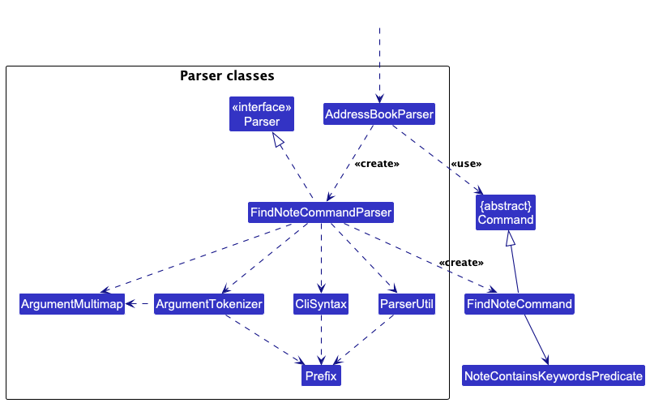

How the `findnote` command works:

1. When the user enters a `findnote` command, `LogicManager` passes it to `AddressBookParser`.
2. `AddressBookParser` creates a `FindNoteCommandParser` to parse the command arguments.
3. `FindNoteCommandParser` trims the input and checks that at least one keyword is provided.
4. `FindNoteCommandParser` splits the input into individual keywords.
5. A `NoteContainsKeywordsPredicate` is created using the parsed keywords.
6. A `FindNoteCommand` object is created using the predicate and executed.
7. `FindNoteCommand` calls `Model#updateFilteredApplicationList(predicate)`.
8. The filtered application list is updated to show only applications whose notes contain any of the specified keywords.
9. A `CommandResult` is returned through `LogicManager`.

#### Design considerations:

**Aspect: How note searching is implemented**

* **Alternative 1 (current choice):** Use `NoteContainsKeywordsPredicate` together with `Model#updateFilteredApplicationList(predicate)`.
    * Pros: Reuses the existing filtered list mechanism and keeps the implementation simple and consistent with other search-related commands.
    * Cons: Only updates the filtered view and does not provide phrase-based matching.

* **Alternative 2:** Manually iterate through all applications in `FindNoteCommand` and build a separate result list.
    * Pros: Allows more direct control over result construction.
    * Cons: Duplicates logic that is already handled cleanly by the model’s filtered list mechanism.

**Aspect: How keywords are matched**

* **Alternative 1 (current choice):** Split the input by whitespace and perform case-insensitive keyword matching.
    * Pros: Simple for users and supports flexible multi-keyword searching.
    * Cons: Does not support exact phrase matching.

* **Alternative 2:** Treat the entire input as one exact phrase.
    * Pros: Supports phrase-based matching.
    * Cons: Less flexible for normal keyword-based searching.


## Add Feature

The sequence diagram below illustrates the interactions within the `Logic` component for an `add` command.


How the `add` command works:

1. When the user enters an `add` command, `LogicManager` passes it to `AddressBookParser`.
2. `AddressBookParser` creates an `AddCommandParser` to parse command arguments.
3. `AddCommandParser` validates and parses fields (e.g., role, phone, email, company, and optional fields).
4. An `AddCommand` object is created and executed.
5. `AddCommand` checks whether the target application already exists (`Model#hasApplication`).
6. If not duplicated, the new application is added (`Model#addApplication`).
7. The updated application book state is committed through `Model#commitAddressBook()`.


## Delete Feature

`delete` is already covered by the core Logic sequence walkthrough in the Design section

This section focuses on features that have additional design considerations (`edit`, `deadline`).

## Edit Feature

The sequence diagram below shows the main interactions for `edit`.
To keep the diagram readable, low-level parsing and field-by-field replacement logic are intentionally omitted.


The class diagram below gives a focused view of the `edit`/`deadline` command area in `Logic` and its links to
core `Model` entities.


How the `edit` command works (high-level):

1. `LogicManager` forwards user input to `AddressBookParser`.
2. `AddressBookParser` creates `EditCommandParser`, which parses index + provided fields.
3. `EditCommand` validates index and duplicate constraints, then builds an updated `Application`.
4. `EditCommand` updates the target via `Model#setApplication(...)` and commits via `Model#commitAddressBook()`.
5. A `CommandResult` is returned to the UI through `LogicManager`.

## Status Feature

The sequence diagram below shows the main interactions for `status`.

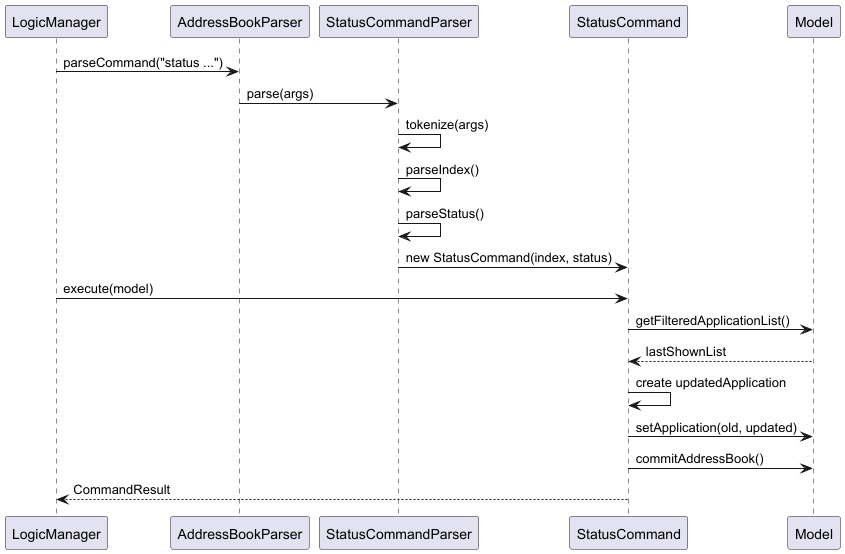

The class diagram below shows the main structure for `status`.

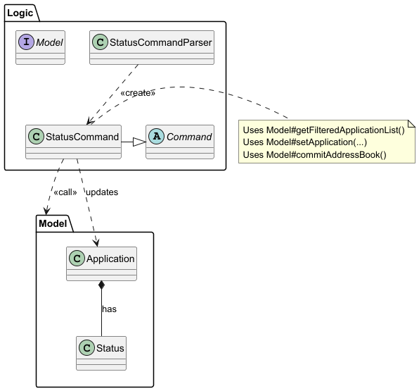

How the `status` command works (high-level):

1. `LogicManager` receives the user input and forwards it to `AddressBookParser`.
2. `AddressBookParser` creates a `StatusCommandParser` to parse the arguments.
3. `StatusCommandParser` extracts the index and validates the provided status.
4. A `StatusCommand` object is created with the parsed values.
5. `StatusCommand` retrieves the target application from Model `getFilteredApplicationList()`.
6. A new `Application` object is constructed with the updated status.
7. The updated application replaces the original via Model `setApplication(...)`.
8. The change is persisted using Model `commitAddressBook()`.
9. A `CommandResult` is returned to the `UI`.

## Deadline Feature

The sequence diagram below shows the command flow for `deadline`.
It highlights command orchestration only; detailed date parsing/validation is abstracted away.


The following activity diagram summarizes the decision flow for deadline updates:


The object diagram shows the before/after object state during an edit that changes deadline-related fields:


How the `deadline` command works (high-level):

1. `LogicManager` routes input to `AddressBookParser`, then `DeadlineCommandParser`.
2. `DeadlineCommandParser` parses index and deadline string into a `DeadlineCommand`.
3. `DeadlineCommand` replaces only the deadline-related part of the target `Application`.
4. `Model#setApplication(...)` and `Model#commitAddressBook()` persist the state change.

## Resume Feature

The sequence diagram below shows the main interactions for `resume`.

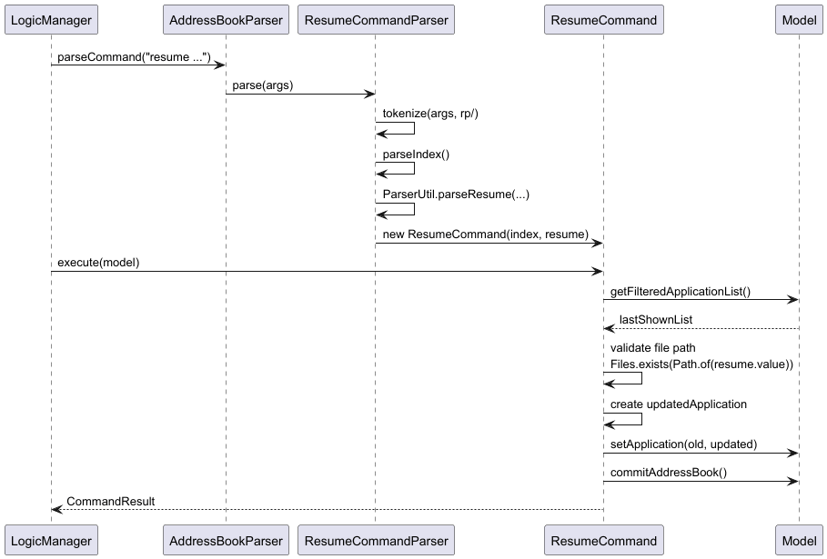

The class diagram below shows the main structure for `status`.

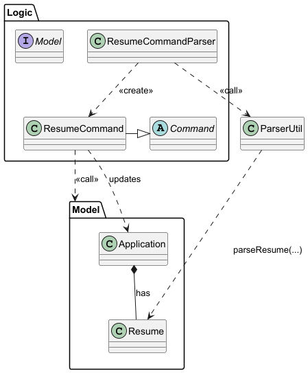

How the `resume` command works (high-level):

1. `LogicManager` receives the user input and forwards it to `AddressBookParser`.
2. `AddressBookParser` creates a `ResumeCommandParser` to parse the arguments.
3. `ResumeCommandParser` extracts the index and parses the resume path into a `Resume` object.
4. A `ResumeCommand` object is created with the parsed index and resume.
5. `ResumeCommand` retrieves the target application from Model `getFilteredApplicationList()`.
6. The command validates that the specified resume file path exists and is a valid path.
7. A new `Application` object is constructed with the updated resume.
8. The updated application replaces the original via Model `setApplication(...)`.
9. The updated state is persisted using Model `commitAddressBook()`.
10. A `CommandResult` is returned to the `UI`.

### Why this level of detail

This DG deliberately documents selected feature internals (instead of every command) to stay maintainable while still
giving developers a roadmap:

* **Where to start**: which command/parser/model classes are involved.
* **What matters architecturally**: component interactions, mutation points, and commit boundaries.
* **What is omitted on purpose**: repetitive parser internals and trivial data plumbing already clear from code.

## ApplicationEvent System

The ApplicationEvent system allows applications to have associated events like online assessments and interviews. This section details the design and implementation of this flexible event system.

### Architecture Overview

The ApplicationEvent system uses inheritance and polymorphism to support different types of events while maintaining a consistent interface:

```
ApplicationEvent (abstract base class)
├── OnlineAssessment (concrete implementation)
└── Interview (concrete implementation)
```

Each `Application` can have at most one `ApplicationEvent` attached, stored as an optional field. The system supports:
- **OnlineAssessment**: Events with platform and link information
- **Interview**: Events with interviewer name and interview type information
- **Extensibility**: New event types can be added by extending `ApplicationEvent`

### Class Structure

**ApplicationEvent (Abstract Base Class)**
- Contains common fields: `location`, `localDateTime`
- Provides abstract methods: `equals()`, `hashCode()`, `toString()`
- Validates datetime format using `isValidDateTime()`
- Uses `DATETIME_FORMATTER` for consistent formatting

**OnlineAssessment (Concrete Implementation)**
- Extends `ApplicationEvent` with `platform` and `link` fields
- Represents online coding assessments, technical tests
- Example: HackerRank assessment with assessment portal link

**Interview (Concrete Implementation)**
- Extends `ApplicationEvent` with optional `interviewerName` and `interviewType` fields
- Represents interviews with optional additional details
- Supports interviews with unknown interviewer/type (empty string defaults)

### Command Integration

#### Assessment Command Flow

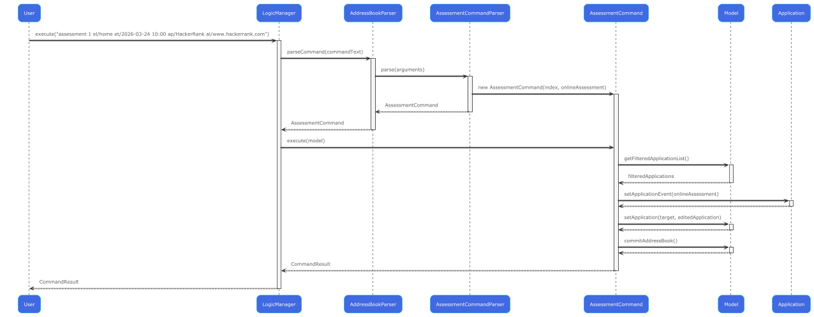

1. User enters `assessment INDEX el/LOCATION et/DATETIME ap/PLATFORM al/LINK`
2. `AssessmentCommandParser` validates and parses all required fields
3. `AssessmentCommand` creates an `OnlineAssessment` object
4. Command replaces any existing event on the target application
5. Updated application is saved via `Model#setApplication()` and committed

#### Interview Command Flow

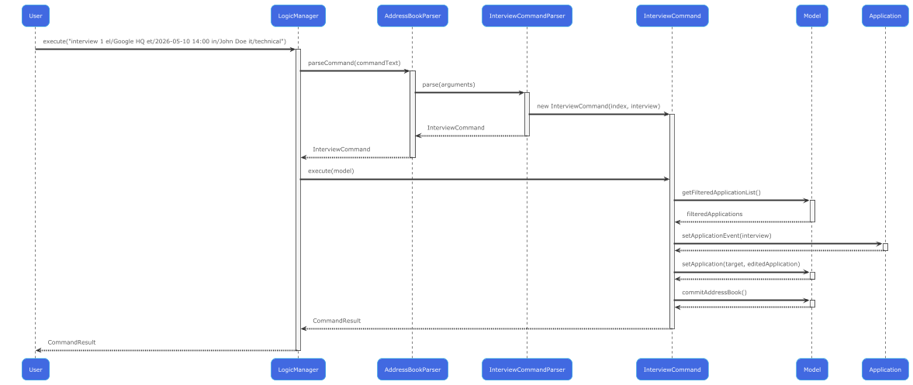

1. User enters `interview INDEX el/LOCATION et/DATETIME [in/INTERVIEWER] [it/TYPE]`
2. `InterviewCommandParser` validates required fields, handles optional fields
3. `InterviewCommand` creates an `Interview` object with optional parameters
4. Command replaces any existing event on the target application
5. Updated application is saved and committed to model

#### Event Removal

The `removeevent` command works uniformly across all event types:
1. Validates the target application has an event
2. Sets the application's event field to `null`
3. Commits the change through the model

### Storage and Persistence

The ApplicationEvent system integrates with the JSON storage layer through `JsonAdaptedApplication`:

#### Serialization Strategy
- **Flat Storage**: Event fields are stored directly in the application JSON
- **Type Detection**: Event type is determined by which fields are present
- **OnlineAssessment**: Stored when `assessmentPlatform` and `assessmentLink` are non-null
- **Interview**: Stored when assessment fields are null but event location/time exist

#### Storage Fields
```json
{
  "eventLocation": "Google HQ",
  "eventTime": "2026-05-10 14:00",
  "assessmentPlatform": null,
  "assessmentLink": null,
  "interviewerName": "John Doe",
  "interviewType": "technical"
}
```

#### Deserialization Logic
```
if (assessmentPlatform != null && assessmentLink != null) {
    // Reconstruct OnlineAssessment
    modelEvent = new OnlineAssessment(eventLocation, modelDateTime, assessmentPlatform, assessmentLink);
} else if (eventLocation != null && eventTime != null) {
    // Reconstruct Interview
    modelEvent = new Interview(eventLocation, modelDateTime, interviewerName, interviewType);
}
```

### UI Integration

The UI system displays events through the `EventDetailsWindow`:

#### Dynamic UI Rendering
- **Event Button**: Appears on application cards when an event exists
- **Event Window**: Opens when user clicks the event button
- **Dynamic Fields**: Shows different fields based on event type:
    - OnlineAssessment: Platform, Link
    - Interview: Interviewer Name, Interview Type

#### Implementation Details
- `EventDetailsViewModel` handles event type branching
- `EventDetailsWindow` uses `setRowVisible()` to show/hide relevant fields
- FXML layout accommodates both event types with conditional visibility

### Design Considerations

#### Event Storage Strategy

**Current Choice**: Single event per application with inheritance hierarchy
- **Pros**: Simple model, clear ownership, easy UI integration
- **Cons**: Limited to one event per application

**Alternative Considered**: Multiple events per application
- **Pros**: More flexible, supports complex scheduling
- **Cons**: Increased complexity, unclear UI representation

#### Persistence Approach

**Current Choice**: Flat storage in JSON with type inference
- **Pros**: Simple serialization, backward compatible
- **Cons**: Implicit type detection, field coupling

**Alternative Considered**: Tagged union with explicit type field
- **Pros**: Explicit type information, easier debugging
- **Cons**: More verbose JSON, migration complexity

#### Optional Field Handling

**Current Choice**: Empty strings for missing optional fields
- **Pros**: Consistent with existing codebase patterns
- **Cons**: String manipulation required for checks

### Extension Guidelines

To add a new event type (e.g., `GroupInterview`):

1. **Create the class** extending `ApplicationEvent`
2. **Add storage fields** to `JsonAdaptedApplication`
3. **Update serialization logic** in the constructor
4. **Update deserialization logic** in `toModelType()`
5. **Create command and parser** following existing patterns
6. **Update UI components** to handle the new type
7. **Add comprehensive tests** for the new functionality

### Testing Strategy

The ApplicationEvent system includes comprehensive tests at multiple levels:

**Unit Tests**:
- `ApplicationEventTest`: Base class validation
- `OnlineAssessmentTest`: OnlineAssessment-specific behavior
- `InterviewTest`: Interview-specific behavior and optional fields

**Integration Tests**:
- `AssessmentCommandTest`: Command execution and validation
- `InterviewCommandTest`: Command execution with optional parameters
- `JsonAdaptedApplicationTest`: Serialization round-trip testing

**Storage Tests**:
- Persistence across application restarts
- Type inference during deserialization
- Backward compatibility with existing data


--------------------------------------------------------------------------------------------------------------------

## **Documentation, logging, testing, configuration, dev-ops**

* [Documentation guide](Documentation.md)
* [Testing guide](Testing.md)
* [Logging guide](Logging.md)
* [Configuration guide](Configuration.md)
* [DevOps guide](DevOps.md)

--------------------------------------------------------------------------------------------------------------------

## **Appendix: Requirements**

### Product scope

**Current version scope (implemented):**
* Manage internship applications as records with role, company/contact details, status, deadline, note, tags, resume link, and optional event (online assessment or interview).
* Support fast CLI-based workflows for add/edit/delete/find/findnote/list/sort/status/deadline/reminder/assessment/interview/removeevent.
* Support recovery and safety operations (`undo`/`redo`, auto-save to local JSON).

**Near-future scope (planned):**
* Archive completed applications into a separate view.
* Richer filtering and reporting/export workflows.

### Target user profile

Hired! is designed for university students who are applying for internships and need to manage multiple
application records, deadlines, contacts, and interview progress efficiently.

Our target users:
* need to manage a significant number of internship applications and related contacts
* prefer a desktop application over mobile notes or spreadsheets
* can type quickly
* prefer typing to mouse interactions
* are reasonably comfortable using CLI applications
* want a structured way to track internship applications, deadlines, and follow-ups

**Value proposition**: Hired! helps university students manage internship applications, company contacts, deadlines,
and interview records faster and more systematically than scattered notes or spreadsheet-based
tracking.

### User stories

Priorities: High (must have) - `* * *`, Medium (nice to have) - `* *`, Low (unlikely to have) - `*`

| Priority | As a … | I want to … | So that I can… |
| --- | --- | --- | --- |
| `* * *` | student applying for internships | add an application with core details (role/company/contact) | start tracking each opportunity quickly |
| `* * *` | student applying for internships | list and view all applications | maintain overall visibility of my pipeline |
| `* * *` | student applying for internships | edit any application fields | keep records accurate as information changes |
| `* * *` | student applying for internships | delete wrong or obsolete application records | keep my list clean and relevant |
| `* * *` | student applying for internships | search by role keywords (`find`) | quickly locate target opportunities |
| `* * *` | student applying for internships | search by note keywords (`findnote`) | retrieve follow-up context efficiently |
| `* * *` | student applying for internships | update status quickly (`status`) | track my progress stage clearly |
| `* * *` | student applying for internships | set or clear deadlines (`deadline`) | avoid missing key submission timelines |
| `* * *` | student applying for internships | sort by deadline or role (`sort`) | prioritize urgent items or browse alphabetically |
| `* * *` | student applying for internships | highlight urgent/overdue items (`reminder`) | focus immediately on time-sensitive applications |
| `* * *` | student applying for internships | undo/redo recent data-changing operations | recover safely from mistakes |
| `* * *` | student applying for internships | attach/open/remove a resume path per application | jump to supporting documents quickly |
| `* *` | student applying for internships | record online assessment details and remove them later | prepare and manage OA schedules in one place |
| `* *` | student applying for internships | record interview details with optional interviewer and type info | manage interview schedules with available context |
| `* *` | student applying for internships | search by company name or role | quickly find a specific application |
| `* *` | student applying for internships | categorize companies by industry | organize applications more clearly |
| `* *` | student applying for internships | tag companies by interest level | prioritize which opportunities to focus on |
| `* *` | student applying for internships | remove events (assessments/interviews) when no longer needed | keep application records clean and current |
| `*` | student applying for internships | take notes on interview questions | reflect and improve for future interviews |
| `* *` | student applying for internships | filter applications by status | focus on active applications only |
| `*` | student applying for internships | set reminders for deadlines or follow-ups | avoid missing important next steps |
| `*` | long-term user | archive old application records | keep the application list organized |
| `*` | long-term user | export internship records | analyse my application progress outside the app |
| `*` | long-term user | view a summary of application outcomes | understand my internship search performance |

Notes:
* Stories above include both currently implemented and near-future needs.
* For the current version, implemented stories correspond to commands listed in the User Guide command summary.

## Use cases

(For all use cases below, the **System** is `Hired!` and the **Actor** is a `student`, unless specified otherwise)

Use cases below intentionally focus on **non-trivial and unique** interaction patterns.
Simple one-step interactions (e.g., `list`, `help`, `exit`) are covered by User Guide command docs instead.

### **UC01 - Add an Application Record**

**Precondition**

* System is running

**MSS**

1. Student requests to add a new internship application.
2. Student provides required details: role, phone, email, company (and optional fields).
3. System validates the input.
4. System saves the application.
5. System displays the newly added application.

   Use case ends.

**Extension**

* 2a. Student omits optional fields.
    * 2a1. System applies default values (e.g., default status, empty note/deadline).

      Use case resumes at step 3.

* 3a. System detects invalid input (e.g., format/constraint violations).
    * 3a1. System shows an error message.
    * 3a2. Student re-enters valid data.

      Use case resumes at step 3.

* 4a. System detects a duplicate application.
    * 4a1. System informs the student.

      Use case ends.

### **UC02 – Edit an Existing Application**

**Precondition**

* System is running
* At least one application exists in the system.
* Application list is visible (possibly filtered).

**MSS**

1. Student requests to edit an application.
2. Student provides a list index and one or more fields to change.
3. System verifies the application exists.
4. System validates all provided field values.
5. System updates the application.
6. System commits the new state for undo/redo.
7. System displays the updated application.

   Use case ends.

**Extensions**
* 3a. Application ID/index does not exist.
    * 3a1. System shows an error.

      Use case ends.

* 4a. Any provided field value is invalid.
    * 4a1. System shows validation error.
    * 4a2. Student re-enters valid values.

      Use case resumes at step 4.

* 5a. Edited record duplicates an existing application identity.
    * 5a1. System rejects the edit and shows duplicate error.

      Use case ends.

### **UC03 – Manage deadline urgency (deadline + reminder)**

**Precondition**
* System is running.
* At least one application exists.

**MSS**
1. Student sets/updates a deadline for an application.
2. System validates date/time format and calendar validity.
3. System saves the updated application.
4. Student runs `reminder`.
5. System sorts applications by deadline and enables urgency highlighting; a new undo/redo checkpoint is created only if this `reminder` run is effective.
6. System displays updated ordering and visual urgency cues.

   Use case ends.

**Extensions**
* 2a. Date/time format or value is invalid.
    * 2a1. System shows format/validation error.
    * 2a2. Student enters a valid deadline.

      Use case resumes at step 2.

* 1a. Index does not exist in current displayed list.
    * 1a1. System shows index error.

      Use case ends.

### **UC04 – Undo/redo after state-changing commands**

**Precondition**
* System is running.
* At least one state-changing command has been executed.

**MSS**
1. Student executes a state-changing command (e.g., add/edit/delete/deadline/status/sort/reminder).
2. Student executes `undo`.
3. System restores the previous state.
4. Student executes `redo`.
5. System reapplies the undone state.

   Use case ends.

**Extensions**
* 2a. No undoable state exists.
    * 2a1. System shows an error.

      Use case ends.

* 4a. No redoable state exists.
    * 4a1. System shows an error.

      Use case ends.

### **UC05: Delete an application**

**Precondition**

* System is running
* At least one application exists in the system

**MSS**

1.  Student requests to list applications
2.  Hired! shows a list of applications
3.  Student requests to delete a specific application in the list
4.  Hired! deletes the application

    Use case ends.

**Extensions**

* 1a. The list is empty.
    * 1a1. Hired! informs user the list is empty

      Use case ends.

* 3a. The given index is invalid.

    * 3a1. Hired! shows an error message.

      Use case resumes at step 2.

### **UC06 – Add/overwrite and remove online assessment event**

**Precondition**
* System is running.
* At least one application exists.

**MSS**
1. Student runs `assessment INDEX el/... et/... ap/... al/...`.
2. System validates all required fields.
3. System saves assessment details on the target application (overwriting existing event if present).
4. Student runs `removeevent INDEX`.
5. System removes the event from the target application.

   Use case ends.

**Extensions**
* 2a. Any required assessment field is invalid/missing.
    * 2a1. System shows validation error.

      Use case ends.

* 4a. Target application has no event.
    * 4a1. System shows error and keeps data unchanged.

      Use case ends.

Related interactions with similar flow:
* `status`, `deadline`, and `removeresume` follow the same index-validate-update-commit pattern as UC02.
* `openresume` follows index-validate-open-resource flow and is intentionally omitted as a simpler variant.

### Non-Functional Requirements

**Technical Requirements**
1.  Should work on any _mainstream OS_ as long as it has Java `17` or above installed.
2.  The system should operate as a standalone application without requiring an active internet connection.
3.  The system must store all internship application data in a _local text file_ (JSON format) and must _not_ require the installation or use of any external Database Management System (e.g., MySQL, PostgreSQL).
4.  The system must be developed using only standard Java `17` libraries and the JavaFX framework. Any third-party libraries must be less than `10MB` in total and must not require separate installation by the user.
5.  The entire application must be packaged into a single executable JAR file not exceeding `100MB`. The user should be able to run it by simply double-clicking the file, provided Java `17` is installed.

**Performance Requirements**
1. Should be able to hold up to `1000` applications without a noticeable sluggishness in performance for typical usage.
2. The system should respond to any valid user command (e.g., adding an application or finding applications) within `100` milliseconds under normal usage conditions.

**Usability Requirements**
1.  A user with above average typing speed for regular English text (i.e. not code, not system admin commands) should be able to accomplish most of the tasks faster using commands than using the mouse.
2.  All critical features (creating and updating an application record) must be _executable entirely_ via keyboard without requiring mouse interaction.
3.  A tech-savvy user should be able to master the basic commands (Add, Find, List, Edit) within `10` minutes of reading the User Guide.

**Reliability & Data Integrity**
1. The system must _automatically_ save all changes to the local storage after every successful state-changing command (e.g., add, edit, delete) to prevent data loss in case of a crash or accidental exit.
2. If a command involves multiple steps, the operation must be atomic. Either both changes are made correctly, or no changes are saved at all.
3. A tech-savvy user should be able to open the data file in a standard text editor and understand the stored application fields and optional event data.
4. The system must be able to read and migrate data files produced by earlier versions of the same product within the same major version.
5. The application should prevent logically inconsistent or invalid data from being stored (e.g. unsupported status values or deadlines in an invalid format).

### Glossary

* **Mainstream OS**: Windows, Linux, Unix, macOS
* **Role**: The position/title applied for.
* **Status**: The current stage of an internship application (e.g. APPLIED, INTERVIEWING, OFFERED, REJECTED, WITHDRAWN).
* **Company**: The organisation that offers the opportunity.
* **Record**: One application entry in Hired!, including fields such as role, company, status, deadline, tags, note, and optional event details.
* **Reminder**: A command that sorts applications by deadline and applies deadline-based highlighting in the UI.
* **Deadline**: The date/time stored on an application and used by `reminder` and `sort time`.
* **ApplicationEvent**: An optional event associated with an application, such as an online assessment or interview.
* **OnlineAssessment**: A type of ApplicationEvent representing online coding tests or assessments with platform and link information.
* **Interview**: A type of ApplicationEvent representing interview appointments with optional interviewer name and type details.
* **MSS**: Main Success Scenario. The primary, happy-path flow of a use case, describing what happens when everything goes as expected with no errors or exceptions
* **JSON Data File**: A JSON format text file used for local storage of all internship data.
* **Executable JAR**: The runnable packaged application file (`hired.jar`) used to launch Hired!.
* **Data Integrity**: The property that stored data remains valid and internally consistent with model constraints.

--------------------------------------------------------------------------------------------------------------------

## **Appendix: Instructions for manual testing**

Given below are instructions to test the app manually.

<div markdown="span" class="alert alert-info">:information_source: **Note:** These instructions only provide a starting point for testers to work on;
testers are expected to do more *exploratory* testing.

</div>

### Launch and shutdown

1. Initial launch
    1. Download the `.jar` and place it in an empty folder.
    2. Run `java -jar hired.jar`.
    3. Verify the main window is shown and sample applications are loaded.

2. Window preference persistence
    1. Resize and move the window, then close the app.
    2. Launch again.
    3. Verify the previous window size and position are restored.

3. Graceful exit
    1. Run `exit`.
    2. Verify the application closes without errors.

4. Close from window controls
    1. Launch the app and close it via the window close button (`X`).
    2. Relaunch the app.
    3. Verify the app starts normally and previous window preferences are still applied.

### Core command flows

1. Add, list, edit, delete
    1. Run:
       * `add r/Software Engineer p/98765432 e/hr@example.com c/Google`
       * `list`
       * `edit 1 d/2026-12-31 note/Follow up next week`
       * `delete 1`
    2. Verify each command shows success feedback and list updates accordingly.

2. Invalid index handling
    1. Run `list` then try `edit 0 r/Test`, `delete 999`, `deadline 999 2026-12-31`.
    2. Verify index-related error messages are shown and data remains unchanged.

3. Find and findnote
    1. Add at least two applications with different roles/notes.
    2. Run `find engineer` and `findnote follow`.
    3. Verify only matching applications are shown.

4. Status, deadline, reminder, sort
    1. Run:
       * `status 1 s/OFFERED`
       * `deadline 1 2026-12-31 23:59`
       * `sort time`
       * `reminder`
    2. Verify:
       * status changes and is reflected in UI,
       * deadline is updated,
       * sort ordering changes as expected,
       * reminder enables urgency highlighting behavior.

5. Undo and redo
    1. Execute two state-changing commands (e.g., `add`, `edit`).
    2. Run `undo` twice, then `redo` once.
    3. Verify list/data state transitions are correct.
    4. Run `undo` repeatedly at earliest state and verify proper error is shown.

### Resume and event features

1. Resume attach/open/remove
    1. Prerequisite: one valid local file path to `.pdf`, `.doc`, or `.docx`.
    2. Run:
       * `resume 1 rp/<ABSOLUTE_PATH>`
       * `openresume 1`
       * `removeresume 1`
    3. Verify attach/remove feedback is correct and `openresume` opens via OS default handler.

2. Assessment add/remove
    1. Run:
       * `assessment 1 el/home et/2026-03-24 10:00 ap/HackerRank al/www.hackerrank.com`
       * `removeevent 1`
    2. Verify event is added/removed correctly and related UI updates accordingly.
    3. Negative case: run `removeevent 1` again and verify error is shown.

### Saving data

1. Auto-save on state-changing commands
    1. Run `add ...` (any valid add).
    2. Close the app and relaunch.
    3. Verify the added data persists.

2. Missing data file recovery
    1. Launch once and close the app.
    2. Delete `data/applicationList.json`.
    3. Relaunch the app.
    4. Verify app starts normally and recreates data file (with seed/empty data according to current behavior).

3. Corrupted data file handling
    1. Launch once and close the app.
    2. Edit `data/applicationList.json` into invalid JSON (e.g., remove a closing brace).
    3. Relaunch the app.
    4. Verify app does not crash and reports file format issue appropriately.

4. Save failure due to insufficient write permissions (optional, OS-dependent)
    1. Make the `data` folder or `applicationList.json` non-writable for the current user.
    2. Launch the app and run any state-changing command (e.g., `edit`, `status`).
    3. Verify an error is shown indicating data cannot be saved due to file permission issues.
